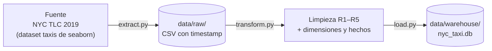
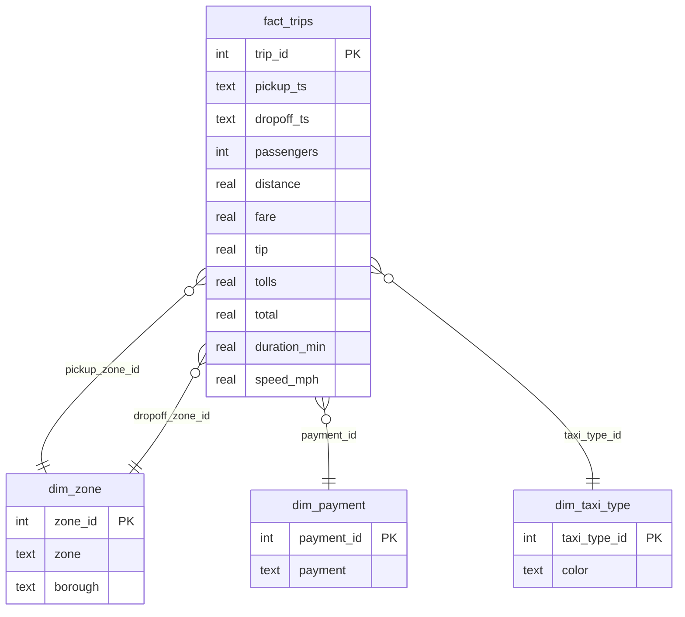

# NYC Taxi Pipeline — ETL a esquema estrella


Pipeline **ETL en Python** que toma viajes de taxi de Nueva York (NYC Taxi & Limousine Commission, feb–mar 2019), los limpia con **reglas de negocio auditables** y los carga en un **data warehouse SQLite** modelado como **esquema estrella**.

El objetivo es mostrar las prácticas de un pipeline profesional en un proyecto pequeño: capa de *landing* inmutable, transformaciones trazables, integridad referencial y cargas idempotentes.

---

## Arquitectura



| Capa | Archivo | Responsabilidad |
|------|---------|-----------------|
| **Extract** | `src/extract.py` | Obtiene el crudo y lo aterriza en `data/raw/` con timestamp UTC, sin transformar nada. |
| **Transform** | `src/transform.py` | Aplica las reglas de limpieza, calcula métricas derivadas y construye dimensiones y hechos. |
| **Load** | `src/load.py` | Crea el DDL con llaves primarias y foráneas, y carga respetando el orden de las FK. |

## Modelo de datos



`dim_zone` es una **dimensión de rol**: una sola tabla sirve para la zona de origen y la de destino.

## Reglas de limpieza

Ninguna fila se elimina en silencio: cada regla registra cuántas filas afectó.

| Regla | Qué hace | Por qué |
|-------|----------|---------|
| R1 | Imputa `"Unknown"` en nulos categóricos (pago, zonas, boroughs) | Los viajes tienen montos válidos; eliminarlos sesgaría el ingreso. |
| R2 | Elimina viajes con duración ≤ 0 min | Físicamente imposible. |
| R3 | Elimina viajes con velocidad > 60 mph | Error de medidor. |
| R4 | Elimina viajes con distancia = 0 | Solo viajes operativamente válidos. |
| R5 | Elimina viajes con 0 pasajeros | Solo viajes operativamente válidos. |

## Decisiones de diseño

- **Landing zone inmutable:** el crudo se guarda tal cual; siempre se puede volver a transformar sin volver a extraer.
- **Llaves sustitutas** en todas las dimensiones.
- **Integridad referencial doble:** se valida en Python (`assert`) y en la base (`PRAGMA foreign_keys = ON`), y al final se verifica que no haya huérfanos.
- **Idempotencia:** cada corrida hace *full refresh* (`DROP` + `CREATE`).

## Cómo ejecutarlo

```bash
git clone https://github.com/SaidHoffman/nyc-taxi-pipeline.git
cd nyc-taxi-pipeline

python -m venv .venv
.venv\Scripts\activate          # Windows
# source .venv/bin/activate     # Linux / macOS

pip install -r requirements.txt

python src/extract.py   # aterriza el crudo en data/raw/
python src/load.py      # transforma y carga el warehouse
```

El resultado queda en `data/warehouse/nyc_taxi.db`.

### Consulta de ejemplo

```sql
SELECT z.borough,
       COUNT(*)                                        AS viajes,
       ROUND(AVG(f.total), 2)                          AS ticket_promedio,
       ROUND(AVG(f.tip / NULLIF(f.fare, 0)) * 100, 1)  AS propina_pct
FROM fact_trips f
JOIN dim_zone z ON f.pickup_zone_id = z.zone_id
GROUP BY z.borough
ORDER BY viajes DESC;
```

## Estructura

```
nyc-taxi-pipeline/
├── data/
│   ├── raw/          # landing zone (ignorado por git)
│   └── warehouse/    # SQLite con el esquema estrella (ignorado por git)
├── src/
│   ├── extract.py
│   ├── transform.py
│   └── load.py
└── requirements.txt
```

## Siguientes pasos

- Orquestar las tres capas con Airflow o Prefect.
- Agregar pruebas con `pytest` para las reglas R1–R5.
- Leer los archivos Parquet oficiales de NYC TLC para escalar a millones de viajes.
- Migrar el warehouse a DuckDB o PostgreSQL.

---

**Autor:** [Said Sigala Morales](https://github.com/SaidHoffman) · [Portafolio](https://said-sigala.netlify.app/) · [LinkedIn](https://www.linkedin.com/in/saidsigala)
